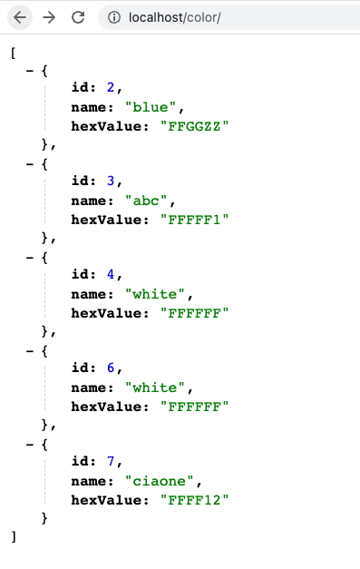
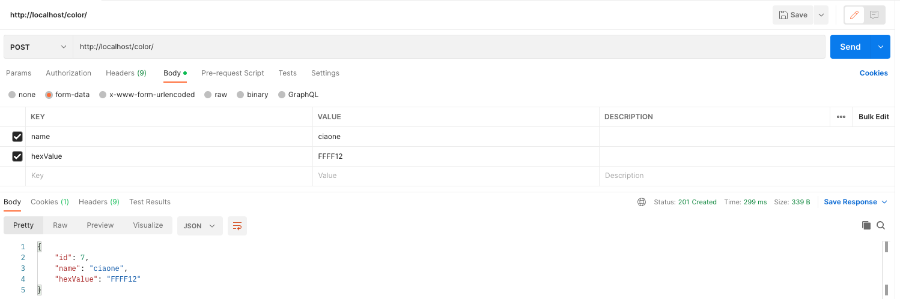

## About

Demo task for the "Acme" company.
Create a RESTful API server for GET, POST, DELETE operations on a Color entity.
The color has a "name" and a "hex" value.

## Rules
- I can only use [http-server-request](https://github.com/sunrise-php/http-server-request) composer package
- PHP 7.4

### Install php dependencies
```shell
docker run --rm -v ${PWD}:/var/www -it composer:2.3 bash -c "cd /var/www && composer install"
```


### Run phpunit tests:
```shell
docker run --rm -v ${PWD}:/var/www -it php:7.4-alpine sh -c "cd /var/www/ && php vendor/bin/phpunit tests/"
```

### Run
```
Nginx && mysql ...
```

Open [http://localhost/color/](http://localhost/color/)





